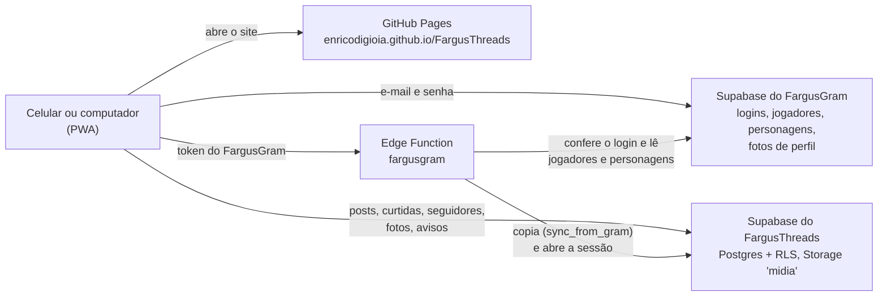
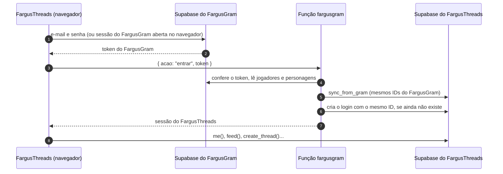

<div align="center">


# FargusThreads

**A rede de conversas dos personagens da campanha de RPG Fargus.**
Inspirada no Threads e irmã do [FargusGram](https://github.com/EnricoDiGioia/FargusGram): entra com a mesma conta e já traz os mesmos personagens e NPCs.

[](https://github.com/EnricoDiGioia/FargusThreads/actions/workflows/deploy.yml)


[**Abrir o app**](https://enricodigioia.github.io/FargusThreads/) · [Como colocar no ar](docs/DEPLOY.md) · [Guia de uso](docs/GUIA-DE-USO.md)


</div>

## Sobre o projeto

O FargusThreads é um app web em que cada jogador publica como os seus personagens, e o mestre como os NPCs, em posts curtos com conversas, citações, enquetes e tópicos. Ele funciona no navegador e se instala no celular como um app (PWA), no iPhone e no Android, sem passar pelas lojas e sem custo.

A conta é a mesma do FargusGram. O FargusGram continua sendo o dono dos logins, dos jogadores e dos personagens; o FargusThreads lê esses dados de lá e guarda tudo o que é publicado num Supabase próprio, para que os dois apps não dividam o mesmo limite do plano grátis.

## Funcionalidades

**Publicar**
- Posts de até 500 caracteres com até 10 fotos, reduzidas e comprimidas no próprio aparelho
- Sequências de até 10 partes ligadas por uma linha, como no Threads
- Enquetes de 2 a 4 opções, com prazo de 1 hora a 7 dias
- Tópicos no post e #hashtags no texto, com página própria para cada um
- @menções com sugestões de personagens enquanto se escreve
- Escolha de quem pode responder e citar: qualquer pessoa, perfis que você segue ou só os mencionados
- Edição nos primeiros 15 minutos (o post fica marcado como editado) e exclusão

**Conversar**
- Feed **Para você** e **Seguindo**, com posts e reposts
- Responder, repostar, citar, curtir, salvar e copiar o link de um post
- Página da conversa com o que veio antes, a sequência do autor e as respostas
- Atividade com curtidas, respostas, menções, citações, reposts e novos seguidores, com filtros

**Personagens**
- Login com a conta do FargusGram, inclusive "Continuar com o FargusGram" quando ele está aberto no mesmo navegador
- Vários personagens por jogador e troca rápida entre eles (o mestre usa para os NPCs)
- Perfil com abas Threads, Respostas, Mídia e Reposts; bio e link próprios ou a bio do FargusGram
- Seguidores próprios, com a opção de seguir de uma vez as mesmas contas do FargusGram
- Selo de verificado, admins e números de perfil famoso vindos do FargusGram

**App**
- Instalável no celular, com ícone próprio e cache das fotos já vistas
- Tema automático, claro ou escuro; layout de celular e de computador
- Busca de personagens, tópicos e posts, e sugestões de quem seguir

## Tecnologias

| Camada | O que usa |
| --- | --- |
| Interface | React 19, React Router 7 (rotas com `#`), Lucide (ícones), CSS puro com variáveis para os temas |
| Build | Vite 8 |
| Dados | Supabase: Postgres com Row Level Security, funções RPC em SQL e Storage para as fotos |
| Login | Supabase Auth do FargusGram + Edge Function `fargusgram` (Deno) no Supabase do FargusThreads |
| Hospedagem | GitHub Pages, publicado pelo GitHub Actions a cada push na `main` |
| App instalável | Web App Manifest e service worker próprio |

## Arquitetura



### Como o login funciona



- A senha só vai para o Supabase do FargusGram. O FargusThreads recebe apenas o token, que a função confere antes de fazer qualquer coisa.
- O endereço e a chave do FargusGram ficam fixos dentro da função, para ninguém conseguir apontá-la para outro Supabase.
- A cada 15 minutos de uso, o app pede à função uma nova cópia dos personagens. Quem sai do grupo no FargusGram sai daqui também, com o que publicou.

## Rodando localmente

**Requisitos:** [Node.js](https://nodejs.org) 22 ou mais novo e Git.

```bash
git clone https://github.com/EnricoDiGioia/FargusThreads.git
cd FargusThreads
npm install
npm run dev
```

O terminal mostra o endereço local e um endereço de rede, que abre no celular se ele estiver no mesmo Wi-Fi.

> [!WARNING]
> Sem configuração extra, o `npm run dev` usa o mesmo Supabase do site publicado: o que você publicar testando aparece para o grupo. Para testar à parte, crie outro projeto no Supabase e aponte o app para ele com um `.env.local` (veja abaixo).

### Configuração

Os valores padrão ficam em [`src/config.js`](src/config.js) e podem ser trocados por variáveis de ambiente do Vite. Copie o [`.env.example`](.env.example) para `.env.local` (que o Git ignora) e preencha só o que quiser trocar.

| Variável | O que é |
| --- | --- |
| `VITE_SUPABASE_URL` | URL do Supabase do FargusThreads |
| `VITE_SUPABASE_KEY` | Chave pública (`sb_publishable_…`) do Supabase do FargusThreads |
| `VITE_GRAM_URL` | URL do Supabase do FargusGram |
| `VITE_GRAM_KEY` | Chave pública do Supabase do FargusGram |
| `VITE_GRAM_SITE` | Endereço do FargusGram publicado (usado nos botões "Abrir no FargusGram") |

Essas chaves são públicas por natureza, porque vão para o navegador de todo mundo. Quem protege os dados são as regras de segurança do `supabase/setup.sql`. A chave `secret` (ou `service_role`) nunca entra no app.

### Scripts

| Comando | O que faz |
| --- | --- |
| `npm run dev` | Servidor de desenvolvimento com recarga automática |
| `npm run build` | Gera o site final em `dist/` |
| `npm run preview` | Serve o `dist/` localmente, para conferir o build |
| `node scripts/keepalive.mjs` | Faz a consulta que impede o Supabase de pausar (o robô do GitHub roda isso a cada 3 dias) |
| `test/run-db-test.sh` | Testes do banco num Postgres local (veja [Testes](#testes)) |

## Estrutura do projeto

```text
FargusThreads/
├── .github/workflows/
│   ├── deploy.yml             # build e publicação no GitHub Pages
│   └── keepalive.yml          # consulta a cada 3 dias contra a pausa do Supabase
├── docs/
│   ├── DEPLOY.md              # tutorial para colocar no ar e atualizar
│   ├── GUIA-DE-USO.md         # como usar o app no dia a dia
│   └── telas.jpg
├── public/                    # ícones, manifesto do PWA e service worker (sw.js)
├── scripts/keepalive.mjs
├── src/
│   ├── config.js              # endereços e chaves públicas dos dois Supabase
│   ├── App.jsx                # rotas e telas de entrada
│   ├── pages/                 # telas: início, conversa, escrever, busca, atividade, perfil...
│   ├── components/            # post, enquete, fotos, menus, navegação...
│   ├── lib/                   # api, login com o FargusGram, fotos, cache, tema, PWA
│   ├── state/                 # sessão (jogador e personagem ativo) e avisos na tela
│   └── styles/app.css         # visual, temas claro e escuro
├── supabase/
│   ├── setup.sql              # tabelas, regras de segurança, gatilhos e funções
│   └── functions/fargusgram/  # função de login com a conta do FargusGram
└── test/                      # testes do banco
```

## Banco de dados

Tudo está em [`supabase/setup.sql`](supabase/setup.sql), que pode ser rodado de novo sem apagar dados.

| Tabela | Conteúdo |
| --- | --- |
| `players`, `characters` | Cópia dos jogadores e personagens do FargusGram, com os mesmos IDs. Só a bio e o link do personagem são editados aqui |
| `posts` | Posts, respostas e partes de sequência (`parent_id`, `root_id`, `is_chain`), citações (`quote_id`), tópico e quem pode responder. Os contadores são mantidos pelos gatilhos |
| `post_media` | Fotos de cada post, no bucket público `midia` |
| `likes`, `reposts`, `saves` | Curtidas, reposts e salvos (os salvos só o dono vê) |
| `polls`, `poll_options`, `poll_votes` | Enquetes; cada um vê só o próprio voto |
| `follows` | Quem segue quem no FargusThreads |
| `notifications` | Atividade de cada personagem |

**Segurança.** Todas as tabelas usam Row Level Security: só quem é jogador do FargusGram enxerga alguma coisa, e cada um só age pelos próprios personagens. Posts novos e edições passam só pelas funções `create_thread`, `edit_post` e `delete_post`, que conferem dono, limites, prazos e quem pode responder. A cópia de jogadores e a importação de seguidores (`sync_from_gram`, `import_follows`) só podem ser chamadas pela função `fargusgram`, com a chave secreta.

**Funções que o app chama:** `me`, `feed`, `thread_view`, `profile`, `profile_posts`, `topic_posts`, `saved_posts`, `search`, `suggestions`, `follow_list`, `post_activity`, `activity`, `unread_counts`, `mark_activity_read`, `create_thread`, `edit_post`, `delete_post`, `vote`, `all_characters` e `ping`.

**Mudanças no banco.** Uma novidade que precise de algo novo no banco vem num arquivo em `supabase/atualizacoes/`, e a mesma mudança entra no `setup.sql`. O passo a passo está em [docs/DEPLOY.md](docs/DEPLOY.md#atualizar-o-banco).

## Testes

`test/run-db-test.sh` cria um banco do zero num Postgres 16 local (porta 54322, socket em `/tmp`), roda o `setup.sql` duas vezes para garantir que ele pode ser repetido e faz mais de 80 verificações: permissões e regras de segurança, contadores, sequências, quem pode responder, enquetes, avisos, busca, edição e exclusão, e a sincronização com o FargusGram. O arquivo `test/supabase-shim.sql` imita o pedaço do Supabase de que o script precisa (papéis, `auth.uid()` e `storage`).

O script foi feito para Linux ou WSL:

```bash
./test/run-db-test.sh
```

## Publicação

O site é publicado no GitHub Pages pelo workflow [`deploy.yml`](.github/workflows/deploy.yml) a cada push na branch `main`, e o app instalado avisa "Nova versão do FargusThreads disponível". O tutorial completo, do zero até o primeiro acesso, está em **[docs/DEPLOY.md](docs/DEPLOY.md)**.

## Limites do plano grátis

| Recurso | Limite | Como o app economiza |
| --- | --- | --- |
| Storage (fotos) | 1 GB | Fotos de 200 a 400 KB, comprimidas no aparelho; apagar um post apaga as fotos. Fotos de perfil vêm do FargusGram |
| Banco | 500 MB | Só texto e números |
| Tráfego | 5 GB por mês | Fotos já vistas ficam guardadas no celular |
| Pausa por inatividade | 7 dias sem uso | O robô `keepalive.yml` consulta o banco a cada 3 dias |

## Próximos passos

- [ ] Notificações no celular, adaptando a função `push` do FargusGram
- [ ] Vídeos nos posts, aproveitando o editor e o compressor do FargusGram

## Créditos

Projeto pessoal de [Enrico Di Gioia](https://github.com/EnricoDiGioia), feito para a campanha Fargus. Inspirado no Threads, sem nenhuma ligação com a Meta.
