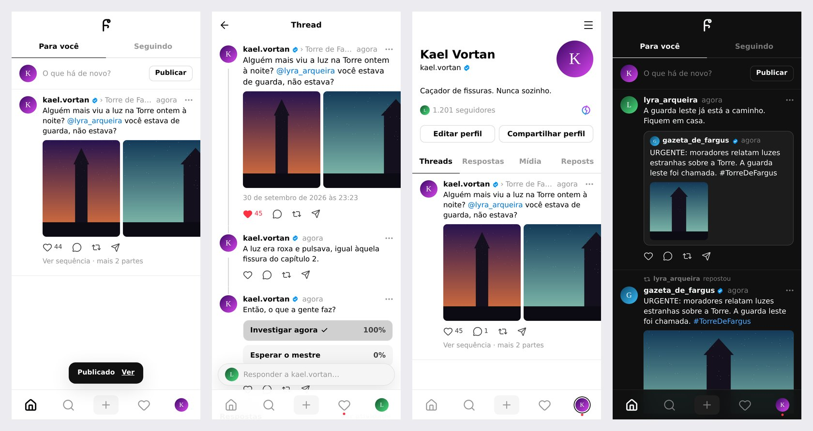

# FargusThreads

O Threads dos personagens da campanha Fargus. Funciona no navegador e se instala no celular como um app, no iPhone e no Android, sem pagar nada.

É o irmão do [FargusGram](https://github.com/EnricoDiGioia/FargusGram): entra com a mesma conta e já traz os mesmos personagens e NPCs, com o mesmo @, foto e selo de verificado. Tudo o que é publicado aqui fica num Supabase só do FargusThreads, para não gastar o espaço grátis do FargusGram.

## O que tem

- Feed **Para você** (todo mundo) e **Seguindo** (só quem o personagem segue), com posts e reposts
- Posts de até 500 caracteres, com até 10 fotos, comprimidas no próprio celular
- **Sequências**: um post em várias partes (até 10), ligadas pela linha, como no Threads
- Responder, repostar, **citar** e compartilhar o link de um post
- **Enquetes** de 2 a 4 opções, com prazo de 1 hora a 7 dias; quem vota vê as porcentagens
- **Tópicos** no post ("› Torre de Fargus") e #hashtags no texto, com página própria
- @menções com sugestões enquanto escreve
- Escolher quem pode responder e citar: qualquer pessoa, perfis que você segue ou só quem você mencionou
- Editar o texto nos primeiros 15 minutos (o post fica marcado como editado) e apagar
- Salvar posts (só o dono vê)
- Atividade: curtidas, respostas, menções, citações, reposts e novos seguidores, com filtros
- Perfil com abas Threads, Respostas, Mídia e Reposts; bio e link próprios do Threads (ou a bio do FargusGram)
- Seguidores próprios do Threads, com o botão **Seguir as mesmas contas** do FargusGram
- Trocar de personagem segurando o ícone do perfil; o mestre usa para os NPCs
- Números extras de perfil famoso (seguidores e curtidas) vindos do Painel do admin do FargusGram
- Busca de personagens, tópicos e posts, e sugestões de quem seguir
- Tema automático, claro ou escuro
- Admins do FargusGram podem apagar qualquer post

## Como funciona

O app é um site feito em React, hospedado de graça no GitHub Pages, igual ao FargusGram. No celular ele vira um PWA: a pessoa adiciona o site à tela inicial e ele abre em tela cheia, com ícone próprio.

São dois Supabase:

- **O do FargusGram** (que já existe) continua sendo o dono das contas, dos jogadores e dos personagens. O FargusThreads só lê de lá.
- **O do FargusThreads** (novo) guarda os posts, fotos, curtidas, seguidores e avisos do Threads.

Para entrar, o app confere o e-mail e a senha no Supabase do FargusGram. Depois manda esse login para a função `fargusgram`, que fica no Supabase do FargusThreads. A função confere o login lá, copia os jogadores e personagens para cá (com os mesmos IDs) e abre a sessão aqui. Ninguém se cadastra no FargusThreads: quem não está no grupo do FargusGram não entra.

Se o FargusGram estiver aberto no mesmo navegador (no computador ou no Chrome do Android), a tela de entrada mostra **Continuar com o FargusGram** com o personagem, e é só tocar.

A cada 15 minutos de uso, o app copia de novo os personagens do FargusGram: nome, foto, selo, NPCs novos ou apagados. Quem sai do grupo no FargusGram sai daqui também, com tudo o que publicou.

## Colocar no ar

Leva uns 20 minutos, uma vez só.

### 1. Criar o projeto no Supabase

1. Entre em [supabase.com](https://supabase.com) com a mesma conta do FargusGram.
2. Clique em **New project**. Use o nome `fargusthreads`, crie uma senha para o banco (guarde, mas o app não usa) e escolha a região **South America (São Paulo)**.
3. Espere um ou dois minutos até o projeto ficar pronto.

O plano grátis do Supabase deixa ter 2 projetos ativos por conta: o FargusGram e o FargusThreads ocupam os dois.

### 2. Criar o banco de dados

1. No projeto **fargusthreads**, abra **SQL Editor** e clique em **New query**.
2. Abra o arquivo `supabase/setup.sql`, copie tudo, cole no editor e clique em **Run**.
3. No fim deve aparecer `FargusThreads: banco configurado com sucesso ✔`.

O Supabase pode avisar que o script tem comandos "destrutivos". Pode confirmar: ele só apaga e recria as próprias regras de segurança, nunca os seus dados. O script pode ser rodado de novo quando quiser.

### 3. Criar a função de login

1. Ainda no **fargusthreads**, abra **Edge Functions** no menu lateral e clique em **Deploy a new function** → **Via Editor**.
2. Apague o código de exemplo e cole todo o arquivo `supabase/functions/fargusgram/index.ts`. O jeito mais fácil de copiar é abrir [este link](https://raw.githubusercontent.com/EnricoDiGioia/FargusThreads/main/supabase/functions/fargusgram/index.ts), apertar Ctrl+A e Ctrl+C.
3. No campo do nome da função, escreva `fargusgram`, exatamente assim, e clique em **Deploy function**.
4. Na página da função, abra **Details** e desligue **Verify JWT with legacy secret** (em painéis mais antigos aparece como **Enforce JWT Verification**). Salve. Quem chama a função ainda não tem login aqui; ela confere o login do FargusGram sozinha.

A função não precisa de nenhuma chave: o endereço e a chave pública do FargusGram já estão no começo do arquivo, e as chaves do próprio Supabase do FargusThreads ele entrega para a função sozinho.

### 4. Fechar o cadastro direto (recomendado)

Ninguém precisa se cadastrar no Supabase do FargusThreads: os logins são criados pela função.

1. Abra **Authentication** → **Sign In / Providers**.
2. Desligue **Allow new users to sign up** e salve. Deixe o provedor **Email** ligado (a função usa).

Mesmo sem isso, quem se cadastrasse por fora não veria nada, porque as regras do banco só liberam quem é jogador do FargusGram.

### 5. Ligar o app ao Supabase novo

1. No projeto **fargusthreads**, clique em **Connect** no topo. A URL também fica em **Project Settings** → **Data API** e a chave em **Project Settings** → **API Keys**.
2. Copie a **Project URL** e a **publishable key** (começa com `sb_publishable_`).
3. Abra `src/config.js` e cole os dois valores na parte **1. Supabase do FargusThreads**. A parte do FargusGram já vem preenchida.

Para mudar só o `src/config.js`, dá para editar direto no site do GitHub: abra o arquivo, clique no lápis, cole os valores e confirme o commit. Nunca coloque no app a chave `secret` ou `service_role`.

### 6. Publicar no GitHub Pages

O código fica no repositório [EnricoDiGioia/FargusThreads](https://github.com/EnricoDiGioia/FargusThreads), que precisa ser **público** (o GitHub Pages gratuito só funciona assim).

1. No repositório, abra **Settings** → **Pages** e, em **Build and deployment** → **Source**, escolha **GitHub Actions**.
2. Abra a aba **Actions** e espere o "Publicar no GitHub Pages" ficar verde. Se alguma execução falhar por ter rodado antes do passo 1, abra a execução e clique em **Re-run all jobs**.
3. O site fica em `https://enricodigioia.github.io/FargusThreads/`.

Toda vez que alguém der push na branch `main`, o site é publicado de novo sozinho.

### 7. Primeiro acesso

1. Abra o site e entre com o **e-mail e a senha do FargusGram**.
2. Na primeira vez aparecem os seus personagens e a opção **Seguir as mesmas contas**: cada personagem passa a seguir aqui quem já segue no FargusGram, sem avisar ninguém.
3. Mande o link no grupo. Cada um entra com a própria conta do FargusGram.

### 8. Instalar no celular

**iPhone:** abra o link no **Safari**, toque em **Compartilhar** e depois em **Adicionar à Tela de Início**. Se o link abrir dentro do WhatsApp ou do Instagram, copie e cole no Safari.

**Android:** abra o link no **Chrome**, toque no menu ⋮ e depois em **Instalar app**.

O próprio app mostra essas instruções no início para quem ainda não instalou.

## No dia a dia

- **Escrever:** toque no **+** da barra de baixo (ou em "O que há de novo?"). O ícone de foto adiciona até 10 fotos, o de gráfico cria uma enquete e o **@** abre as sugestões de personagens. Uma parte não pode ter foto e enquete juntas.
- **Sequência:** toque em **Adicionar à sequência** para escrever a próxima parte. No feed aparece a primeira, com "Ver sequência". Responder o próprio post também continua a sequência.
- **Tópico:** toque em **› Adicionar um tópico**, ao lado do nome, na primeira parte. Um #hashtag no texto leva para a mesma página do tópico (#TorreDeFargus junta com "Torre de Fargus").
- **Quem pode responder:** embaixo, à esquerda, antes de publicar. Vale também para citar.
- **Repostar e citar:** o ícone de setas abre as duas opções. O repost aparece no feed de quem segue você, com "@você repostou".
- **Editar e apagar:** no ⋯ do post. Editar só nos primeiros 15 minutos. Apagar a primeira parte de uma sequência apaga as seguintes; as respostas dos outros continuam, com "Respondendo a um post apagado".
- **Trocar de personagem:** segure o ícone do perfil na barra de baixo, ou toque na sua foto ao escrever. Um ponto vermelho no ícone do perfil avisa que outro personagem seu tem novidades.
- **Personagem novo ou foto nova:** crie ou mude no FargusGram e toque em **Atualizar** na troca de personagem (ou em Configurações → **Atualizar personagens**).
- **Bio e link:** no seu perfil, **Editar perfil**. Dá para usar a bio do FargusGram ou escrever uma só para o Threads.
- **Admin:** quem é admin no FargusGram é admin aqui e pode apagar qualquer post pelo ⋯.
- **Tirar alguém do grupo:** apague a conta no FargusGram (lá, em **Authentication** → **Users**). Na próxima cópia dos personagens (roda quando alguém do grupo usa o FargusThreads, no máximo a cada 15 minutos), a pessoa sai daqui também, com tudo o que publicou.

## Atualizações do banco

Quando uma novidade do app precisar de algo novo no banco, ela vem num arquivo separado dentro de `supabase/atualizacoes/`, como no FargusGram: abra o SQL Editor do **fargusthreads**, cole o arquivo e clique em **Run**. Quem instala do zero só precisa do `setup.sql`. Por enquanto não há nenhuma.

## Limites do plano grátis

- **Fotos:** o Supabase do FargusThreads tem 1 GB só dele. Cada foto sai do celular com uns 200 a 400 KB, então cabem alguns milhares. Apagar um post apaga as fotos dele.
- **Fotos de perfil:** continuam vindo do FargusGram e não ocupam espaço aqui.
- **Banco:** 500 MB, que é muito para textos, curtidas e avisos.
- **Tráfego:** 5 GB por mês. As fotos já vistas ficam guardadas no celular.
- **Pausa por falta de uso:** o Supabase pausa projetos grátis depois de 7 dias sem uso. O robô "Manter o Supabase acordado" (`.github/workflows/keepalive.yml`) faz uma consulta a cada 3 dias. O GitHub desliga robôs agendados em repositórios públicos depois de 60 dias sem commits; se acontecer, abra **Actions** → "Manter o Supabase acordado" → **Enable workflow**. Se o projeto pausar mesmo assim, entre no painel do Supabase e clique em **Restore project**.
- **Se o FargusGram pausar,** ninguém consegue entrar de novo até ele voltar, mas quem já estava logado no FargusThreads continua usando normalmente.

## Privacidade

- Posts, perfis e avisos só aparecem para quem é jogador do FargusGram.
- As fotos ficam num bucket público do Supabase. O endereço de cada arquivo é longo e aleatório, mas quem tiver o link consegue abrir. Não publique nada sensível.
- Os salvos e os votos de cada um só o dono vê. Nas enquetes, os outros veem só as porcentagens.
- A senha nunca passa pelo Supabase do FargusThreads: ela vai só para o do FargusGram. O FargusThreads recebe apenas o login já conferido.

## Mudar o app depois

- Edite os arquivos, faça commit e push. Em poucos minutos o site é atualizado, e o app no celular avisa "Nova versão do FargusThreads disponível".
- Para rodar no computador: instale o [Node.js](https://nodejs.org) 22 ou mais novo, depois rode `npm install` e `npm run dev`.
- Se uma mudança precisar de algo novo no banco, crie um arquivo em `supabase/atualizacoes/`, coloque a mesma mudança no `setup.sql` e rode o arquivo no SQL Editor.
- Os testes do banco ficam em `test/`: com um Postgres 16 local na porta 54322, `test/run-db-test.sh` cria um banco do zero, roda o `setup.sql` duas vezes e confere permissões, contadores, sequências, enquetes, avisos e a sincronização.

## Onde fica cada coisa

| Caminho | O que é |
| --- | --- |
| `supabase/setup.sql` | Banco do FargusThreads, regras de segurança e funções |
| `supabase/functions/fargusgram/` | Função que confere o login do FargusGram, copia os personagens e abre a sessão |
| `src/config.js` | URL e chave dos dois Supabase |
| `src/lib/auth.js` | Entrar com o FargusGram, sincronizar e importar quem segue |
| `src/lib/api.js` | Chamadas ao banco do FargusThreads |
| `src/pages/` | As telas do app |
| `src/components/` | Peças reutilizadas pelas telas (post, enquete, fotos, menus) |
| `src/styles/app.css` | Visual (claro e escuro) |
| `public/` | Ícones, manifesto de instalação e service worker (cache) |
| `.github/workflows/` | Publicação automática e robô contra a pausa |
| `test/` | Testes do banco num Postgres local |
